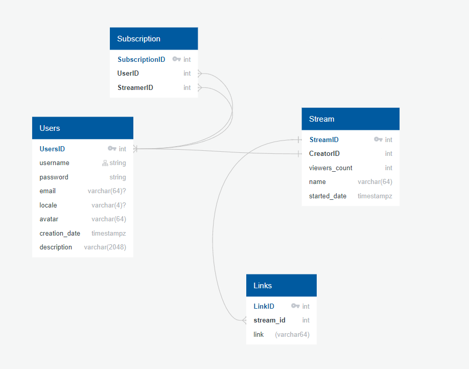

# Проектирование высоконагруженных систем. Курсовой проект

## 1. Тема и целевая аудитория

Twitch - видео стриминговый сервис, специализирующийся на тематике компьютерных игр

### MVP включает

* Просмотр прямых трансляций пользователей через веб-интерфейс  
* Регистрация аккаунтов зрителей и авторов трансляций
* Соответствующий трансляции чат зрителей
* Поиск и подбор идущих трансляций, система подписок на каналы
* Подсчет количества зрителей (телеметрия для более релевантного поиска)

## Целевая аудитория ([статистика](https://pro.similarweb.com/#/companyresearch/websiteanalysis/audience-geography/twitch.tv/*/840/2021.01-2021.03)):

Всего у Twitch есть аудитория в 140 миллионов активных пользователей

Рассмотрим их по регионам 

* США - 31,94 миллионов в месяц
* Германия - 9,17 миллионов в месяц
* Россия - 6,2 миллионов в месяц
* Канада - 5,97 миллиона в месяц
* Франция - 5,83 миллиона в месяц
* Англия - 5,27 миллионов в месяц
* Бразилия - 5,18 миллионов в месяц
* Корея - 4,59 миллионов в месяц
* Турция - 3,43 миллионов в месяц
* Испания - 3,318 миллионов в месяц
* Другие страны - 49,7 миллиона в месяц

## 2. Расчет нагрузки

### Продуктовые метрики

Twitch в месяц посещают 214,4 миллионов пользователей (включая случайных)[[1]](https://pro.similarweb.com/#/companyresearch/websiteanalysis/audience-geography/twitch.tv/*/840/2021.01-2021.03)

Среднее время визита 8 минут 28 секунд [[1]](https://pro.similarweb.com/#/companyresearch/websiteanalysis/audience-geography/twitch.tv/*/840/2021.01-2021.03)

Каждый день Twitch посещают в среднем 7,14 миллионов раз, однако 
есть пики посещаемости и ежедневная посещаемость Twitch сильно варьируется.[[1]](https://pro.similarweb.com/#/companyresearch/websiteanalysis/audience-geography/twitch.tv/*/840/2021.01-2021.03). Заходя человек видит стартовую страницу. 


Пользователей Twitch можно разделить на стримеров (создателей трансляций) и зрителей (зрителей трансляций). В свою очередь каждый стример является одновременно и потенциальным зрителем. Рассмотрим сначала действия пользователя с точки зрения стримера. На Twitch есть около 130 тысяч активных трансляций [[2]](https://twitchtracker.com/statistics). Пользователь-стример начиная трансляцию вынуждает сервис при необходимости оповещать каждого подписчика о начавшемся стриме и помещает его стрим в потенциальные подборки. Таким образом 130 тыс./день запросов на создание трансляции.

Стартовая страница Twitch представляет собой Подборку из наиболее релевантных стримов по категориям, список ведущих трансляцию в данный момент каналов (из подписок пользователя), следовательно на каждый заход пользователя на twitch, ему необходимо предоставить ему данную информацию. Важно отметить, что список отслеживаемых каналов появляется только у зарегистрированных пользователей. Для последующих расчетов предположим, что 30% ежедневных пользователей зарегистрированы.  

Таким образом запросов на подборку стримов по категориям для любых пользователей - 7,14 млн/день

Учитывая 30% зарегистрированных пользователей получим 2,14 млн/день запросов на отслеживаемых стримеров зарегистрированным пользователем. 

30% посещений происходит с запросом авторизации, тогда ежедневно выполняется также 2,14 миллионов запросов на авторизацию. Тогда 6,42 млн/день запросов на страницу стримера.

Допустим попав на главную страницу пользователей нажмут хотя-бы на один канал. Однако также многие пользователи переходят на трансляции по ссылкам из других источников. При заходе на канал загружается страница стримера. Предположим, что хотя-бы 90% всех заходов на Twitch так или иначе приводят к загрузке расширенной странице стримерa, что также в свою очередь приводит к подключению пользователя (даже не авторизованного) к просмотру чата.

Одна из крайне популярных функций Twitch - общение в чате, закрепленным за каждой трансляцией. Оценить количество запросов на отправку сообщения в чате крайне сложно. Учитывая [[4]](https://stats.streamelements.com/), допустим, что в день отправляется около 70 миллионов сообщений в день.  


**Среднее количество действий пользователей**
Тип запроса             | Среднее количество (млн/день)
----------------------- | -----------------------------
Отправка сообщения в чат| 70 
Авторизация             | 2,14
Список отслеживаемых    | 2,14 
Подборка по категориям  | 7,14
Страница стримера       | 6,42
Начало трансляции       | 0,13

### Технические метрики

Основная функция Twitch - просмотр стримов (трансляций). За 2022 год в среднем количество людей, непосредственно смотрящих стримы в прямом эфире в один момент времени - 2,80 миллиона пользователей [[2]](https://twitchtracker.com/statistics). 

Создание трансляций и потоковая передача видео - одна из самых больших задач стоящих перед сервисом. Учитывая [[3]](https://twitchtracker.com/statistics/stream-time) . Ежемесячно загружается около **65 миллионов часов стримов**. 

```
65 000 000 / 30 = 2166666 часов стримов в день
2166666 * 60 * 60 = 7 800 000 000 секунд стримов в день
7 800 000 000 секунд * 3500 кбит/c = 2.94e+13 кбит = 2 500 000 Гб/сутки входящего трафика
```

Важно отметить,что в течении дня оно распределено намного аккуратнее, чем просмотр трансляции

**Входящий трафик**

Тип запроса             | Объём 1 запроса (Кб) | Суточный объём (Гб/сутки) | Пиковое потребление в течении суток (Гбит/с)
----------------------- | -------------------- | ------------------------- | --------------------------------------------
Авторизация             | 1                    | 2.14                      | 0.0001
Сообщение в чате        | 0.25                 | 17.5                      | 0.01 
Страница стримера        | 2000              | 332 031                   | 70
Загрузка трансляции | - | 2 500 000 | 2000 


Страница стримера включает в себя его профиль с различными баннерами, шапками, аватарами. Оценим размер всех данных файлов в среднем 2000 кбайт.

Площадка предлагает возможность просмотра трансляции в разном разрешении, поэтому для последующих расчетов будем использовать средний битрейт в 3500кбит/c [[3]](https://help.twitch.tv/s/article/guide-to-broadcast-health-and-using-twitch-inspector?language=en_US#:~:text=Bitrate%20Spikes,-This%20stream%20may&text=While%20the%20average%20bitrate%20is,to%20buffer%20and%20experience%20issues.) для одного условного зрителя. При среднем времени визита 8 минут 28 секунд (508 секунд) [[1]](https://pro.similarweb.com/#/companyresearch/websiteanalysis/audience-geography/twitch.tv/*/840/2021.01-2021.03). Предположим, что один из 7,14 млн. человек 90% этого времени смотрит трансляцию, в таком случае:

``` 
508 * 0.9 = 457 секунд просмотра стрима
457 * 3500 кбит/c = 1.6 гбит трафика на каждого зрителя в день в среднем
1.6 гбит = 0.4 Гб
0.4 Гб * 7.14 млн = 2 856 000 гб исходящего трафика 
```

Просмотр чата подразумевает просмотр его истории. Учитывая [[2]](https://twitchtracker.com/statistics). Получаем около 100 активных зрителей-участников чата в среднем. (Оценка приблизительная и только приблизительно учитывает факт того, что большинство людей сидят на больших стримах, а количественно многие стримы смотрит 0 или 1 зритель). То есть, каждый зритель постоянно должен смотреть историю чата, где есть ~100 человек, следовательно исходящий трафик включает весь потенциальный трафик от этих людей. Таким образом, средняя активность одного человека влечет за собой в среднем 100-кратную активность со стороны других участников чата. Учтем Суточный объем и объем 1 запроса из расчетов входящего трафика на сообщение в чате, тогда. При этом размер одного сообщения сохраняется маленьким.


``` 
17.5 * 100 = 175 гб 
```

**Исходящий трафик**
Тип запроса             | Объём 1 запроса (Кб) | Суточный объём (Гб/сутки) | Пиковое потребление в течении суток (Гбит/с)
----------------------- | -------------------- | ------------------------- | --------------------------------------------
Просмотр трансляций     | -                  | 2 856 000                     | 4000 
Страница стримера         | 2000                 | 12 840                 | 50
Просмотр сообщений         | 0.25                 | 175                 | 1

**Количество RPS по типам запросов**

Авторизация 

```
7 140 000 пользователей в день / 24 / 60 ~ 5000 запросов на получение данных пользователя в секунду 
```


Начало трансляций 

```
130 тысяч трансляций в день / 24 / 60 ~ 10 запросов на начало стрима в секунду
```


Тип запроса             | RPS
----------------------- | -----
Авторизация             | 5000 
Страница стримера       | 100
Сообщения               | 8 000
Начало трансляций     | 10 
Количество зрителей на стриме |  

## 3. Логическая схема БД



## 4. Физическая схема БД

Для хранения всех данных будем использовать PostgreSQL. Так как количество чтений значительно превышает количество записей было бы уместно использовать slave-master репликацию и реплики чтения. Также следовало бы использовать кэширование информации о количестве зрителей и решить проблему с крайне высоким количеством запросов на авторизацию.  Для этого можно использовать in-memory базу данных Redis.

**Users**

```
4*64 + 4 + 8 + 2048 + 4 = 2320 байт 
140 000 000 * 2320 = 3,248e+11 байт = = 0,3248 Терабайт
```

Индексы по id и username

**Subscribtion**

```
4 + 4 + 4 = 12 байт
Допустим в среднем, один человек имеет 20 подписок, тогда 
140 000 000 * 20 * 12 = 33600000000 байт = 0,0336 Терабайт
```

индексы по user_id

**Stream**

```
4+4+4+64+4 = 80 байт
Так как в MVP не учитываются записи стримов. После окончания стрим удаляется (вместе со всеми связанными записями)
Учитывая 130 000 активных трансляций одновременно: 
80 * 130 000 = 10400000 байт = 10,4 Мегабайт данных
```

**Messages**

Сообщения завязаны на стриме. Данные о прошедших стримах необходимо удалять, вместо с сообщениями , привязанными к стриму. При 70 миллионах сообщений в день

```
4 + 4 + 256 = 264 байт
70 000 000 * 264 = 18480000000 байт = 18,5 Гигабайт
```


**Links**

У каждого стрима есть 6 различных качеств 

- 1080 60FPS

- 1080 30FPS 

- 720 60 FPS

- 720 30 FPS 

- 360 30 FPS 

- 160 30 FPS

Тогда на каждую запись в таблице Stream будет приходиться 6 записей для Links

```
4 + 4 + 64 = 72
72 * 6 * 130 000 = 56160000 байт = 56,16 Мегабайт
```

Для оптимизации работы с БД будем использовать шардирование по регионам. Проверка региона может осуществлятся на основе выставленного языка, либо IP-адреса.

В связи с требованиями оптимизации и распространённостью сервиса в разных странах мира было бы уместно использовать шардирование по регионам. Проверка региона может осуществляться на основе locale или по IP.

**Redis**

В Redis будут храниться сессии пользователей (id пользователя + cookie). 
```
70 000 000 * (4 + 32) = 2520000000 = 2.5гб
```

И счетчики на стримы, состоящие из (id стрима + количество зрителей)

```
130 000 * (4 + 4) = 1040000 байт = 1 Мб
```


## 5. Технологии

| Технология              | Применение                                                   | Причина выбора                                               |
| ----------------------- | ------------------------------------------------------------ | ------------------------------------------------------------ |
| TypeScript              | Язык используемый для написание фронтенда. Поддержка HLS для стримов в браузере | Типизация, ошибки при компиляции                             |
| React                   | Фреймворк для написания клиентской части.                    | Скорость написания, реактивность интерфейса, высокая популярность |
| Nginx                   | Веб-сервер для отдачи статики, обратное прокси               | Производительность, простота настройки                       |
| AWS Elemental MediaLive | Преобразование RTMP потока стримера в HLS потоки разного качества и различного FPS | Удобство настройки, скорость работы, вариативность           |
| Golang                  | Язык backend                                                 | Скорость написания, скорость работы, простота поддержки, популярность |
| RedisDB                 | База данных                                                  | Высокая скорость из-за нахождения данных в оперативной памяти. Простота использования, совместимость с Golang |

## 6. Схема проекта

